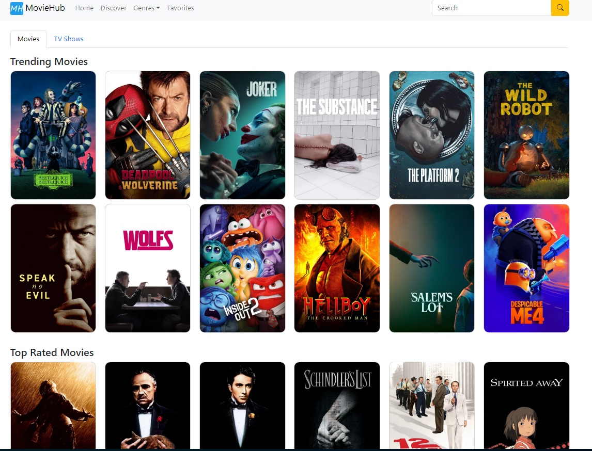
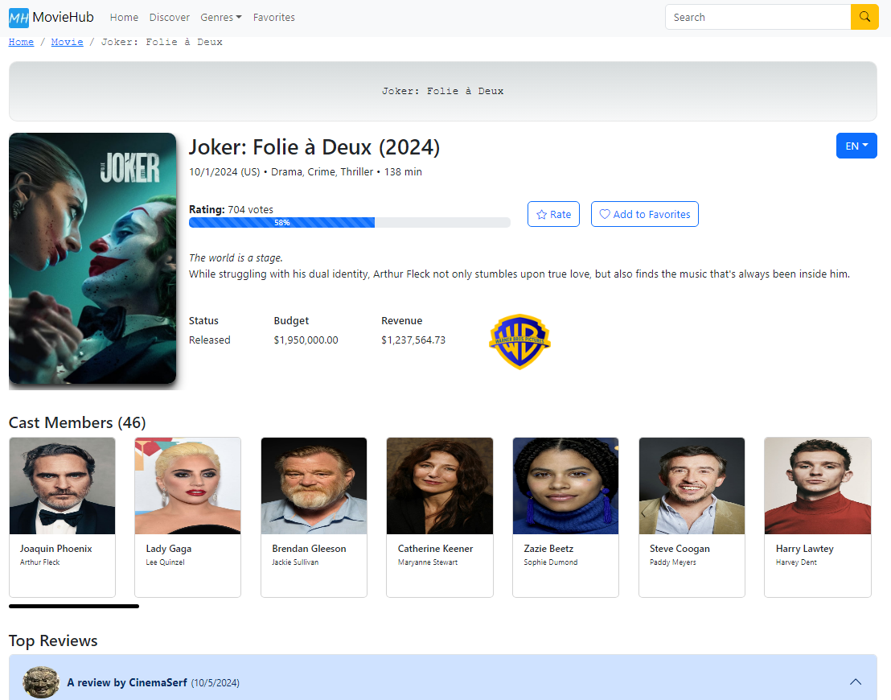

<div>
  <h1 align="center">  MovieHub </h1>
  <h4 align="center">React app for movies and TV series from The Movie Database (TMDB) API, built with the Next.js framework.</h4>
</div>

# Technologies
* [React Client Components](https://github.com/facebook/react)
* [Next.js](https://github.com/vercel/next.js/)
* [React Query](https://github.com/tanstack/query)
* [React Bootstrap](https://github.com/react-bootstrap/react-bootstrap)
* [React Player](https://github.com/cookpete/react-player)

# Run the project
Create a TMDB account (https://developer.themoviedb.org/docs/getting-started) and get an API KEY. Then create a file named ".env.local" in your root project folder and add `NEXT_PUBLIC_API_KEY=[YOUR_API_KEY_HERE]`

```sh
$ npm install
$ npm run dev
```

# Preview
### Homescreen


### Movie Details

